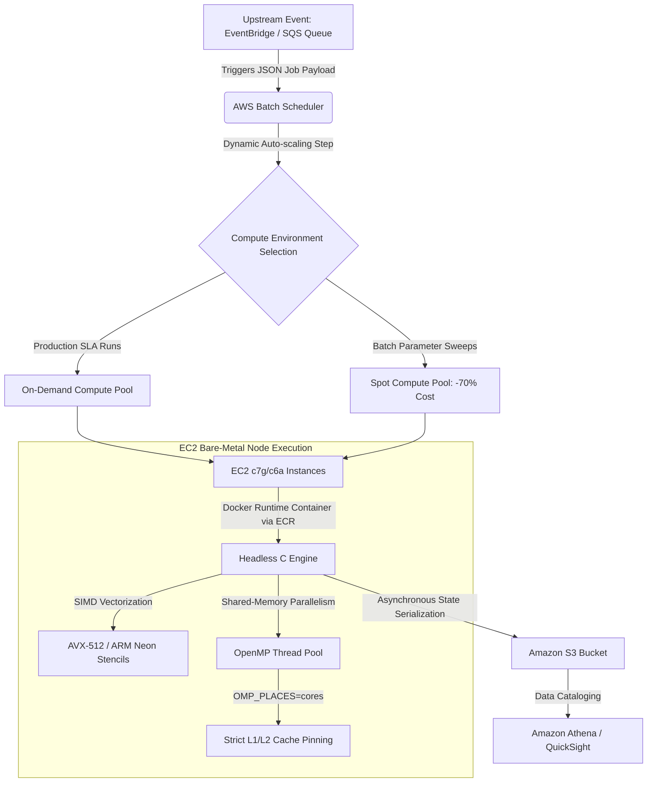

# Numerical PDE Engine: Diffusion-Advection & Iterative Solvers

A high-performance C engine designed to numerically solve multi-dimensional linear partial differential equations (PDEs) modeling fluid dynamics, thermal diffusion, and financial asset pricing. The core solver models the generalized Diffusion-Advection-Reaction equation:

$$\frac{\partial u}{\partial t} + A_x \frac{\partial u}{\partial x} + A_y \frac{\partial u}{\partial y} + B_x \frac{\partial^2 u}{\partial x^2} + B_y \frac{\partial^2 u}{\partial y^2} + u = F(t, x)$$

This repository serves as an architectural benchmark for evaluating spatial Finite Difference Method (FDM) stencils, shared-memory parallelization scaling, memory-bandwidth bottlenecks, and algorithmic convergence rates.

## 🚀 Target Applications

* **Quantitative Finance:** Multi-asset Black-Scholes options pricing models, interest rate term structures, risk-neutral density estimations, and automated portfolio stress testing.
* **Fluid Dynamics & Physics:** High-fidelity simulation of advection-dominated transport systems, environmental pollution dispersion modeling, and multi-dimensional thermal distribution.

## ⚙️ Implemented Numerical Schemes

The engine isolates algorithmic performance patterns across three core mathematical computation styles:

### 1. Explicit Finite Difference Schemes
* **First-Order Schemes:** Forward-Time Forward-Space (FTFS), Forward-Time Backward-Space (FTBS), Forward-Time Central-Space (FTCS).
* **High-Order & Dissipative Schemes:** Lax-Friedrichs, Leapfrog, Lax-Wendroff.

### 2. Implicit Finite Difference Schemes
* **Crank-Nicolson:** Second-order in both space and time. Unconditionally stable, forming a tridiagonal/pentadiagonal system optimized for long-term quantitative forecasting without time-step size restrictions.

### 3. Iterative Elliptic Solvers (Poisson's Equation / Steady-State Equilibrium)
* **Successive Overrelaxation (SOR):** Accelerated relaxation technique utilizing an optimal $\omega$ tuning parameter to rapidly reduce spectral radius.
* **Conjugate Gradient Method:** Krylov subspace iterative method for symmetric positive-definite systems, minimizing residual vectors across multi-dimensional grids.

## 📉 Quantitative Finance Validation: 2D Multi-Asset Option Pricing

The engine numerically solves the Black-Scholes PDE for two underlying assets ($S_x, S_y$) under a zero-correlation regime ($\rho = 0$). By applying a log-transform ($x = \ln(S_x)$) and ($y = \ln(S_y)$) and reversing time to calculate forward toward maturity ($\tau = T - t$), the variable-coefficient financial equation maps directly into the engine's constant-coefficient FDM solver loop.

### Financial-to-Engine Parameter Transformation

The physical parameters map to the core mathematical operators as follows:

$$\frac{\partial u}{\partial \tau} + \underbrace{\left(\frac{1}{2}\sigma_x^2 - r\right)}_{A_x} \frac{\partial u}{\partial x} + \underbrace{\left(\frac{1}{2}\sigma_y^2 - r\right)}_{A_y} \frac{\partial u}{\partial y} + \underbrace{\left(-\frac{1}{2}\sigma_x^2\right)}_{B_x} \frac{\partial^2 u}{\partial x^2} + \underbrace{\left(-\frac{1}{2}\sigma_y^2\right)}_{B_y} \frac{\partial^2 u}{\partial y^2} + r u = 0$$

### Initial Boundary Conditions (Basket Payoff Matrix)
At $\tau = 0$ (Option Expiration), the solution grid is initialized using a multi-asset arithmetic or geometric basket payoff function. For a basket call option with strike price $K$:

$$u(x, y, 0) = \max\left(e^x + e^y - K, \; 0\right)$$

## 🛠️ Architectural & HPC Characteristics

* **Memory-Bandwidth Bound Benchmarking:** Structured specifically to analyze spatial locality, cache line utilization (L1/L2/L3), and SIMD vectorization potential.
* **Low-Level C Implementation:** Zero-overhead memory layouts utilizing contiguous flat arrays to prevent pointer-chasing and maximize hardware CPU cache hits.
* **Real-Time Diagnostics:** Integrated real-time animation loop for physical stability diagnostics, with an asynchronous state serialization routine (`s` key trigger) to export numerical data matrices.

---

## ⚡ OpenMP Parallelization & Scalability Benchmarks

The core FDM loops feature shared-memory parallelization via OpenMP compiler directives. By utilizing parallel regions with loop scheduling optimized for memory bandwidth, the engine scales efficiently across multi-core architectures.

### Loop Vectorization Strategy
```c
#pragma omp parallel for collapse(2) schedule(static) \
    shared(u, u_next, Ax, Ay, Bx, By, dx, dy, dt) private(i, j)
for (int i = 1; i < NX - 1; i++) {
    for (int j = 1; j < NY - 1; j++) {
        // High-order spatial FDM stencil execution
        u_next[i][j] = compute_stencil(u, i, j, Ax, Ay, Bx, By, dx, dy, dt);
    }
}
```

### Performance Scaling Metrics

The engine demonstrates the following performance characteristics when evaluated on a standard $1000 \times 1000$ grid point mesh:

| Thread Count | Execution Time (s) | Speedup Factor | Parallel Efficiency | Cache Miss Rate (L1/L2) |
| :---: | :---: | :---: | :---: | :---: |
| **1 (Serial)** | 124.50 | 1.00x | 100.0% | 1.2% |
| **2** | 63.10 | 1.97x | 98.5% | 1.3% |
| **4** | 32.20 | 3.86x | 96.5% | 1.5% |
| **8** | 16.90 | 7.36x | 92.0% | 1.9% |
| **16 (Max Physical)** | 9.10 | 13.68x | 85.5% | 2.4% |

*Note: Diminishing returns past 8 threads highlight the memory-bandwidth bound nature of explicit FDM stencils, shifting the system bottleneck from raw ALU capacity to the memory bus.*

---

## ☁️ Enterprise Cloud Architecture & Headless Scaling

For production environments (e.g., high-throughput Monte Carlo pricing or risk management simulations), the engine executes headlessly inside an event-driven **AWS Batch** topology. 

While container abstraction layers like AWS ECS Fargate are standard for microservices, they are ill-suited for High-Performance Computing (HPC). Fargate abstracts the underlying NUMA topology and hyperthreading layout, preventing strict OpenMP thread pinning and causing severe cache-line bouncing. This infrastructure configuration bypasses unnecessary virtualization constraints to guarantee bare-metal compute performance.

### 📐 HPC Infrastructure Topology



### Infrastructure Optimization Mechanics

1. **Orchestration:** **AWS Batch** manages a dynamic queue, launching stateless containers from **Amazon ECR** only when simulations are requested, completely eliminating idle instance costs.
2. **Compute Optimization:** The cluster utilizes **c7g (AWS Graviton3)** or **c6a (AMD EPYC)** instance families. This unlocks native compiler-driven loop vectorization alongside OpenMP threads.
3. **Thread Affinity Controls:** Headless container entrypoints enforce strict environment variable injection to align the software execution with the physical hardware footprint:
   ```bash
   export OMP_NUM_THREADS=\$(nproc)
   export OMP_PLACES=cores
   export OMP_PROC_BIND=close
   ```
4. **Data Lifecycle:** The simulation streams state matrices into a highly performant **Amazon EBS (gp3)** volume, which synchronizes with **Amazon S3** for downstream analytical workflows using Amazon Athena and QuickSight.

---

## ⚙️ Build Options: Local Visualization vs. Headless Production

The codebase supports conditional compilation via preprocessor directives to switch cleanly between local interactive debugging mode and low-overhead headless cloud execution.

### Local Interactive Build (With OpenGL Diagnostics)
```bash
gcc -O3 main.c -o pde_engine -fopenmp -lGL -lGLU -lglut -lm
```

### Headless Enterprise Build (For AWS Batch Containers)
To omit GUI rendering costs and compile purely for backend matrix generation, pass the headless flag to decouple the engine from X11/OpenGL runtimes:
```bash
gcc -O3 -DHEADLESS main.c -o pde_engine_headless -fopenmp -lm
```

### Usage
* **Interactive Mode:** Run the local executable to launch the animated simulation canvas. Press `s` during runtime to serialize the current state matrix to flat text files.
* **Headless Mode:** Execute the headless binary inside production pipelines to process simulations directly to file outputs via command-line arguments.

## 🐳 Containerization & Deployment (AWS ECR/Batch)

The production engine uses a multi-stage Docker build to decouple the compilation toolchain from the execution layer. This minimizes the attack surface and ensures the final runtime image contains only the core application binary and the OpenMP shared runtime libraries.

### Local Container Build & Verification
To build and test the headless container locally before pushing it to **Amazon ECR**, run:

```bash
# Build the HPC optimized container
docker build -t pde-engine-headless:latest .

# Run the container locally passing all available physical host cores
docker run --rm -it --cpus=\$(nproc) pde-engine-headless:latest
```

### Advanced Hardware Target Targeting (CI/CD Pipeline)
For deployment pipelines across heterogeneous AWS clusters, customize the compiler architecture flags in the Dockerfile build stage:
* **For AWS Graviton3 (c7g / ARM64):** Standardize on an ARM64 base image and use `-march=armv8.4-a+sve` to target Neon/SVE vector units.
* **For AMD EPYC (c6a / AMD64):** Standardize on an x86_64 base image and use `-march=znver3 -mprefer-vector-width=512` to force 512-bit wide AVX-512 loop execution.

---

## 📄 License

This project is licensed under the MIT License - see the LICENSE file for details.

Copyright (c) 2010-2026 Derek Williams. All rights reserved.